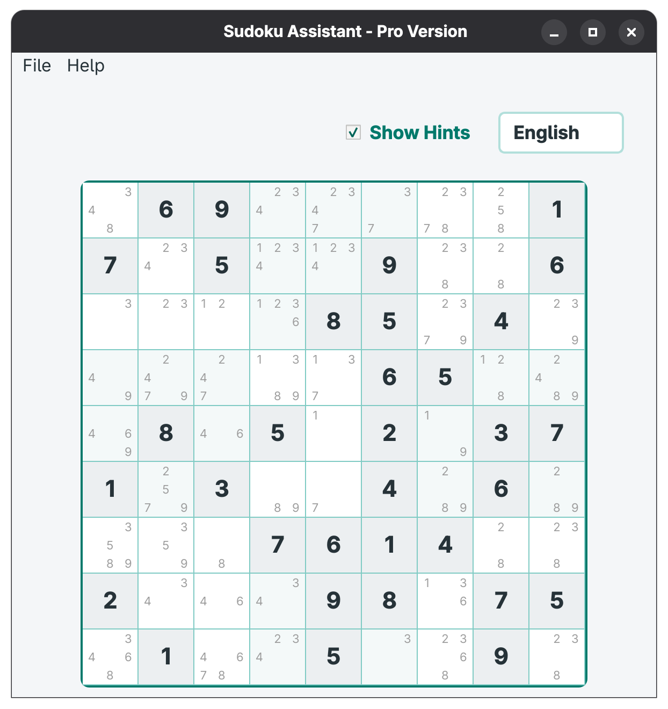

# Sudoku Assistant Pro

> A high-performance, graphical Sudoku application. Developed as a engineering project for the Graphical Interfaces module at ENSICAEN by Abraão de Carvalho Albuquerque.



## ⚡ Core Value Proposition

Sudoku Assistant Pro is a **Model-View-Presenter (MVP)** architecture, completely decoupling the mathematical state engine from the `Qt` rendering layer. The application prioritizes memory efficiency, instantaneous visual feedback, and bulletproof user input handling over naive brute-force UI implementations.

## Technical Features & Innovations

**Zero-Overhead Candidate Rendering:** Rejects the standard, memory-heavy approach of nesting 729 hidden `QLabel` widgets. Instead, it utilizes a custom `QStyledItemDelegate` and bitmasking to paint candidate numbers directly inside empty cells with $O(1)$ data transfer efficiency.

**Stateless Dual-Grid Persistence:** Implements a Save/Load system that maintains the critical distinction between original puzzle constraints and user-input data using a lightweight, dual-matrix text payload.

**Defensive Ergonomics:** Total suppression of native `Qt edit triggers (e.g., double-clicks or F2). Input is monopolized and sanitized via a strict `QObject::eventFilter`, ensuring the mathematical model cannot be corrupted by uncontrolled keystrokes.

**Hot-Swappable Internationalization (i18n):** Seamless, real-time language switching (English/Français) engineered with `Qt`Linguist and`QTranslator`, updating the entire interface dynamically without requiring an application restart.
**Cognitive-Optimized UI/UX:** Features a responsive layout utilizing standard `QMenuBar` navigation and an intelligent, non-intrusive status bar that only materializes to alert the user of immediate mathematical conflicts.

## Software Architecture: The MVP & Observer Paradigm

The most critical decision in this project was the strict adherence to the **Model-View-Presenter (MVP)** architecture, augmented by the **Observer Pattern**. This ensures total separation of concerns: the business logic never touches the GUI, and the GUI never calculates game rules.

### 1. The Model (`SudokuModel`)

A pure C++ class representing the absolute truth of the game state. It holds no dependencies on `Qt`'s graphical libraries.

**Dual-Grid Memory:** Manages both the `m_originalGrid` (fixed puzzle constraints) and the `m_grid` (current user state), enabling stateless Save/Load functionality.

**Rule Engine:** Computes the valid possibilities for any cell in $O(1)$ block/row/column lookups.

**The Observer:** It blindly emits signals (`gridLoaded()`, `cellUpdated()`) when its state changes, completely unaware of who (if anyone) is listening.

### 2. The View (`MainWindow` & `SudokuCellDelegate`)

A "dumb" but highly responsive `Qt` layer. It possesses zero knowledge of Sudoku rules.

Its sole responsibility is to translate user inputs (mouse clicks, keystrokes, language hot-swapping) into `Qt` `signals`.

It exposes public setters (e.g., `setCellValue`, `setCellPossibilities`) so the Presenter can inject data.

It utilizes `QStyledItemDelegate` to hijack the `QPainter`, rendering candidate numbers inside empty cells without instantiating hundreds of redundant widgets.

### 3. The Presenter (`SudokuPresenter`)

The orchestrator. It acts as the strict middleman between the Model and the View.

**Input Sanitization:** Catches View signals (e.g., `inputProvided`), validates them, and commands the Model to update.

**State Synchronization:** Listens to the Model's Observer signals. When the Model updates, the Presenter calculates the delta and commands the View to redraw only the necessary components, updating grid states, warning bars, and candidate hints simultaneously.

By enforcing this architecture, the codebase achieves high testability. The mathematical engine can be fully unit-tested in isolation without ever instantiating a window.

## Architectural Evolution & Advanced Ergonomics

The current architecture is the result of iterative engineering. Initial, straightforward solutions were systematically evaluated and discarded in favor of highly optimized Qt techniques to ensure performance, stability, and a seamless user experience.

### 1. Faster Rendering: `QStyledItemDelegate`

Displaying candidate numbers (hints) inside a 9x9 grid requires tracking up to 9 numbers per cell. The most direct approach initially considered was nesting a 3x3 layout of `QLabel` widgets inside each of the 81 cells. However, this concept was quickly discarded after concluding that maintaining 729 hidden widgets would introduce severe memory overhead, complicate the Qt object tree, and significantly degrade rendering performance. Instead, the final implementation utilizes a custom `SudokuCellDelegate` inheriting from `QStyledItemDelegate` to intercept the `Qt` `QPainter` cycle. If a cell is empty, the delegate reads a highly efficient integer bitmask passed via `Qt::UserRole` and calculates the exact `QRect` coordinates to draw the candidate numbers natively, ensuring zero extra widgets are created.

### 2. Defensive Input Monopolization

Because users are unpredictable, input validation must occur strictly before any data reaches the mathematical Model. Initially, the idea was to utilize `Qt`'s default table editing behavior, which allows users to double-click or press F2 to open a standard `QLineEdit` inside the cell. This approach was rejected because it exposes the application to invalid data types (such as letters or special characters) and entirely bypasses the real-time validation flow. To guarantee state integrity, the `QTableWidget` is now explicitly stripped of its native editing triggers using `QAbstractItemView::NoEditTriggers`. Input is exclusively captured via a strict `installEventFilter` that only reacts to numeric keys (1-9), navigational arrows, and Backspace/Delete. All other inputs are silently discarded at the event level, making state corruption impossible.

### 3. Dynamic i18n Hot-Swapping

Internationalization was treated as a core architectural component rather than an afterthought. The initial concept involved loading translations only during initialization, which would force the user to completely restart the application to change the language. To provide a seamless experience, all user-facing strings are wrapped in `tr()`, allowing the language to be toggled in real-time between English and French via a `QComboBox`. The `MainWindow` intercepts this change, loads the compiled binary `.qm` dictionary via `QTranslator`, and instantly executes a dedicated `retranslateUI()` method to update every label, menu, and tooltip on the fly without interrupting the user's workflow.

### 4. Cognitive Load Reduction & Responsive Geometry

The UI was refactored to respect the user's attention and optimize screen real estate. The first iteration featured a massive, permanent side panel displaying all calculated possibilities, system logs, and errors. This design was ultimately scrapped, because it created cognitive overload by repeating information already visible on the grid and wasted valuable horizontal space. In the final design, the side panel was replaced by a dynamic warning bar located at the bottom of the grid. This status bar remains completely invisible during normal play and only materializes with a distinct warning palette when the user triggers a mathematical conflict. Furthermore, the window utilizes precise `QSizePolicy` parameters to lock the Sudoku grid in a perfect `1:1` aspect ratio, preventing distortion while the main layout handles window maximization.

## Prerequisites & Build Instructions

This project is built using **CMake** to ensure cross-platform compatibility and seamless integration with the Qt6 framework.

### Dependencies

- **C++17** compatible compiler (GCC, Clang, or MSVC).
- **CMake** (version 3.16 or higher).
- **Qt 6** (Specifically: `Core`, `Gui`, `Widgets`, and `LinguistTools`).

### Compilation (Out-of-Source Build)

The build process automatically handles the compilation of the application, the embedding of resources (`.qrc`), and the generation of translation binaries (`.qm` from `.ts`) via `qt_add_translations`.

1. Clone the repository and navigate to the root directory:
   ```bash
   git clone git@github.com:abrxao/sudoku.git
   cd sudoku
   ```
2. Create a build directory and generate the Makefiles

   ```bash
   mkdir build && cd build
   cmake ..
   ```

3. Compile the project (this will also trigger the update_translations target)

   ```bash
   cmake --build .
   ```

### Execution

Once compiled, run the executable from the build directory:

- Linux/macOS: ./SudokuAssistant

- Windows: SudokuAssistant.exe

### Running Unit Tests

The project includes automated tests for the mathematical engine to guarantee business-logic integrity. From inside the build directory, execute:

```bash
ctest --output-on-failure
```

Alternatively, run the test binary directly:

```bash
./tests/SudokuTests
```

---

**Author:** Abraão de Carvalho Albuquerque

**Institution:** ENSICAEN - École Nationale Supérieure d'Ingénieurs de Caen

**Course:** Interfaces Graphiques (Semestre 8)
